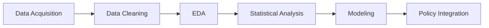

<div align="center">

# 🎯 Polytics

*Analytics Interpreted to Policy*

[](https://github.com/yourorg/yourrepo)
[](https://www.python.org/)
[](LICENSE.md)

</div>

---

## 📋 Overview

> A short summary of your policy analytics solution

* 🔍 **Issue**: The accountability or anti-corruption issue you're addressing
* 📊 **Data Role**: The role of data in your proposed solution
* ✨ **Outcome**: What your tool, model, or analysis accomplishes

---

## 👥 Team Members

| Name | Role | GitHub |
|------|------|--------|
| **Chrystel Jae Santos** | Student | [@Chrystel](https://github.com/username1) |
| **Cristian James Cruz** | Student | [@Cristian](https://github.com/CJ-Zurc) |
| **Jerwin Baron Vitales** | Student | [@Jerwin](https://github.com/username3) |
| **Jim Guitierrez** | Mentor | [@N/A](https://github.com/username4) |
| **John Christian Linaban** | Student | [@JohnC](https://github.com/JChristian25) |
---

## 🎯 Policy Overview

### Theme: Accountability, Reform, and Engagement (ICARE)

<details>
<summary><b>Click to expand policy details</b></summary>

#### 🔴 Corruption-Related Issue
* **Main problem:** Systematic misallocation and opaque awarding of public infrastructure projects (favoring certain localities or contractors), resulting in geographic bias, patronage, and occasional ghost or padded projects.

* **How it appears:** Concentration of projects and budget outlays in politically-favored areas, weak needs-based justification, inconsistent procurement records, and limited public visibility into project selection and spending.

* **Consequences:** Waste and diversion of public funds, poor-quality or unnecessary infrastructure, widened urban–rural inequality, reduced public trust, and weakened service delivery.

* **Evidence to track:** Project locations, approved budgets vs. actual spending, procurement winners and timelines, contract modifications, and implementation/completion records.

#### ⚡ Priority
* **Why this matters:** Infrastructure spending is large and directly affects public services and development; misallocation quickly amplifies inequality and erodes citizen trust in government.

* **Immediate impact:** Equitable, needs-based project allocation improves access to basic services in rural and underserved areas and prevents large-scale waste of taxpayer money.

* **Policy relevance:** Transparent, data-driven oversight enables the Commission on Audit, DBM, DPWH, and LGUs to detect irregularities, enforce accountability, and prioritize projects by demonstrated need.

* **Expected benefits:** Reduced corruption risk, better-targeted investments, measurable improvements in rural service coverage, and clearer evidence for reform and budget decisions.

#### 🏢 Stakeholders
* Which sectors or stakeholders are affected?
Department of Public Works and Highways(DPWH)
Local Government Units (LGU's)
Comission of Audit (COA)
Department of Budget and Management (DBM)

#### 📈 Reform Support
* What reform or decision can your data-driven insights support?
    Our data will support transparency by giving equitable access to infrastructure projects, allocating to not only in urban areas but in rural areas as well. Also, it will support a needs-based approval of projects justifying responsible spending of public funds. 
</details>

---

## 🛠️ Technology Stack

<div align="center">

### Languages


</div>

### 📚 Libraries & Tools

| Category | Tools |
|----------|-------|
| **Data Processing** | `pandas` · `numpy` · `scipy` |
| **Visualization** | `matplotlib` · `seaborn` · `plotly` |
| **Machine Learning** | `scikit-learn` · `tensorflow` |
| **Business Intelligence** | Power BI · Excel |
| **Development** | Jupyter Notebook · VS Code · GitHub |

### 💻 Environment

* **OS**: Windows / Linux / WSL
* **IDEs**: VS Code, Jupyter, RStudio

---

## 🔬 Methodology



### 1️⃣ Data Acquisition
* ✅ Used the official ICARE 2025 dataset
* 📁 Additional publicly available data (if any, cited below)

### 2️⃣ Data Cleaning & Preprocessing
* 🧹 Handling nulls, duplicates, variable transformations
* 🔧 Data filtering and validation

### 3️⃣ Exploratory Data Analysis (EDA)
* 📊 Summary statistics
* 📈 Visual patterns
* 📉 Distribution analysis

### 4️⃣ Statistical / Analytical Methods
* 🤖 Linrear Regression

### 5️⃣ Modeling or Insight Extraction
* 🎯 Key trends and their interpretations
* ✔️ Integrity checks to ensure no bias or data misuse

### 6️⃣ Policy Integration
* 💡 How insights guide accountability or reform
* 🏛️ How findings can inform policymakers

---

## 💡 Insights and Key Findings 

    After implementing statistical treatment it shows that a a positive linear relationship between average population and average project count by region. This means that, in general, regions with larger populations tend to receive more projects

    Evidence shows that corruption absorbs a significant share of infrastructure spending, undermining public trust and weakening project outcomes.

> Highlight your most important findings

* 📊 **Statistical Insights**: Key associations, risk patterns, trends
* 📈 **Visualizations**: Attach images or link to your dashboard
* 🎯 **Policy Relevance**: Interpretations for policymakers
* ⚠️ **Limitations**: Considerations and constraints

<div align="center">

### 📊 Sample Visualization


*Caption: Description of your main visualization*

</div>

> ⚠️ **Note**: All supplemental data must be cited in the README and in charts per ICARE rules.

---

## ⚙️ Setup and Installation Guide

### 📥 Clone Repository

```bash
git clone https://github.com/<org>/icare2025-teamname-projectname.git
cd icare2025-teamname-projectname
```

### 🐍 Python Environment

```bash
# Create virtual environment
python -m venv venv

# Activate virtual environment
# Windows
venv\Scripts\activate
# Linux/Mac
source venv/bin/activate

# Install dependencies
pip install -r requirements.txt
```

### 📊 Power BI / Excel

* Open `dashboard.pbix` or `analysis.xlsx`
* Ensure data connections are properly configured

### 📁 Folder Structure

```
📦 icare2025-teamname-projectname
├── 📂 data/                  # Provided dataset and supplemental data
├── 📂 notebooks/             # Jupyter Notebooks
├── 📂 src/                   # Scripts and tools
├── 📂 visualizations/        # Exported charts and dashboards
├── 📂 docs/                  # Additional documentation
├── 📄 README.md              # This file
├── 📄 LICENSE.md             # License information
└── 📄 requirements.txt       # Python dependencies
```

---

## 📂 Data Source(s)

### 🎯 Primary Dataset (Mandatory)

<table>
<tr>
<td>

**ICARE 2025 Official Dataset**

* Provided by the organizing team
* Data dictionary included in the repository
* Full compliance with competition rules

</td>
</tr>
</table>

### 📚 Supplemental Public Data (If Used)

> ⚠️ **Important**: All supplemental data MUST be cited here and in visualizations.

#### 🇵🇭 Philippine Government Portal

| Source | Description | Link | License |
|--------|-------------|------|---------|
| **PSA** | Philippine Statistics Authority | [psa.gov.ph](https://psa.gov.ph) | Open Data |
| **COA** | Commission on Audit | [coa.gov.ph](https://coa.gov.ph) | Public Domain |
| **DBM** | Department of Budget and Management | [dbm.gov.ph](https://dbm.gov.ph) | Open Data |

#### 🌍 International Organizations

| Source | Description | Link | License |
|--------|-------------|------|---------|
| **World Bank** | Development indicators | [worldbank.org](https://data.worldbank.org) | CC-BY 4.0 |
| **UNDP** | Human Development Reports | [undp.org](https://hdr.undp.org) | Open Data |

> ✅ **Data Compliance**: No personal, scraped, hacked, or illegally obtained data was used, per ICARE 2025 rules.

---

## 📊 Results and Impact
The DBM should issue a Joint Circular/Memorandum that legally requires all LGUs and National Agencies to allocate a protected minimum percentage of their discretionary budget to the combined sectors of Health and Education.

 Formally integrate a Population-Weighted Infrastructure Needs Index (P-WII) into the Budget Call and the Three-Year Rolling Infrastructure Program (TRIP) review process.

 Mandate that all LGU infrastructure projects funded by national transfers (like the LGSF) submit all procurement and project monitoring data (including geo-tagged completion photos) to a centralized DBM-managed public dashboard.

 DBM budget guidelines should provide a funding bias toward maintenance, rehabilitation, and climate-resilient upgrades ("Preservation CAPEX") in regions where the technical asset quality is rated "Fair" or "Poor."
### 📈 Key Metrics

| Metric | Value | Impact |
|--------|-------|--------|
| Data Points Analyzed | X,XXX | Comprehensive coverage |
| Accuracy | XX% | High reliability |
| Policy Recommendations | X | Actionable insights |

### 🎯 Expected Outcomes

* 📋 Specific policy recommendations
* 📊 Evidence-based decision support
* 🔄 Framework for continuous monitoring

---

## 🚀 Usage

### Running the Analysis

```bash
# Run main analysis script
python src/main_analysis.py

# Generate visualizations
python src/generate_plots.py

# Create report
python src/generate_report.py
```

### Jupyter Notebooks

```bash
# Launch Jupyter
jupyter notebook

# Open analysis notebooks in /notebooks folder
```

---

## 📝 Documentation

* 📖 [Detailed Methodology](docs/methodology.md)
* 📊 [Data Dictionary](docs/data_dictionary.md)
* 🔍 [Analysis Guide](docs/analysis_guide.md)
* 🎯 [Policy Brief](docs/policy_brief.md)

---

## 🤝 Contributing

We welcome contributions! Please see our [Contributing Guidelines](CONTRIBUTING.md) for details.

1. Fork the repository
2. Create your feature branch (`git checkout -b feature/AmazingFeature`)
3. Commit your changes (`git commit -m 'Add some AmazingFeature'`)
4. Push to the branch (`git push origin feature/AmazingFeature`)
5. Open a Pull Request

---

## 📜 License

This project is licensed under the MIT License - see the [LICENSE.md](LICENSE.md) file for details.

---

## 🙏 Acknowledgments

* **ICARE 2025 Organizing Committee** - For providing the dataset and competition framework
* **Mentors and Advisors** - For guidance and support
* **Data Providers** - PSA, ICARE Dataset

---

## 📧 Contact

For questions or collaboration opportunities:

* 📧 Email: team@example.com
* 💼 LinkedIn: [Team LinkedIn](https://linkedin.com/company/yourteam)
* 🐦 Twitter: [@yourteam](https://twitter.com/yourteam)

---

<div align="center">

**Made with ❤️ by [Diaphaneia]**

⭐ Star this repository if you find it helpful!

</div>
